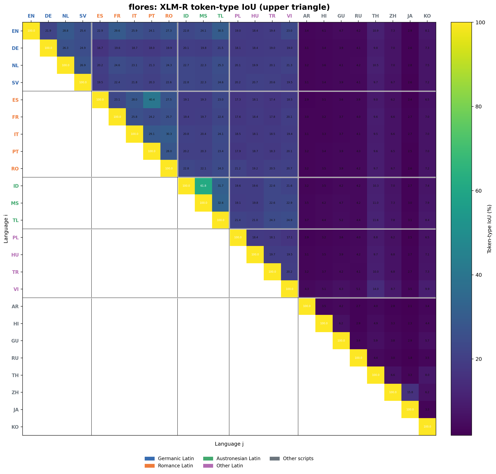
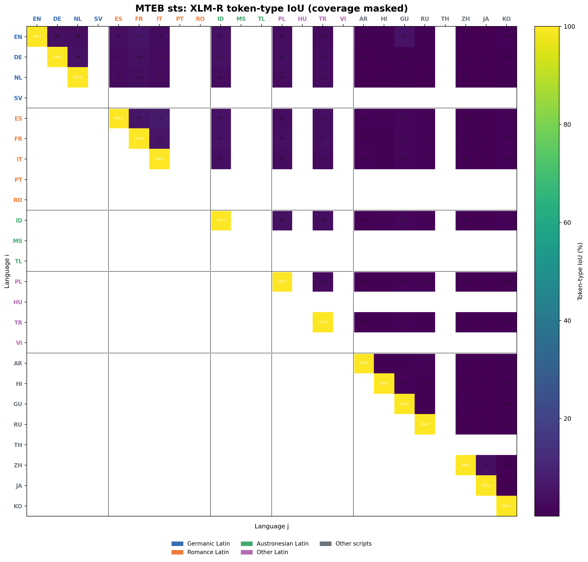
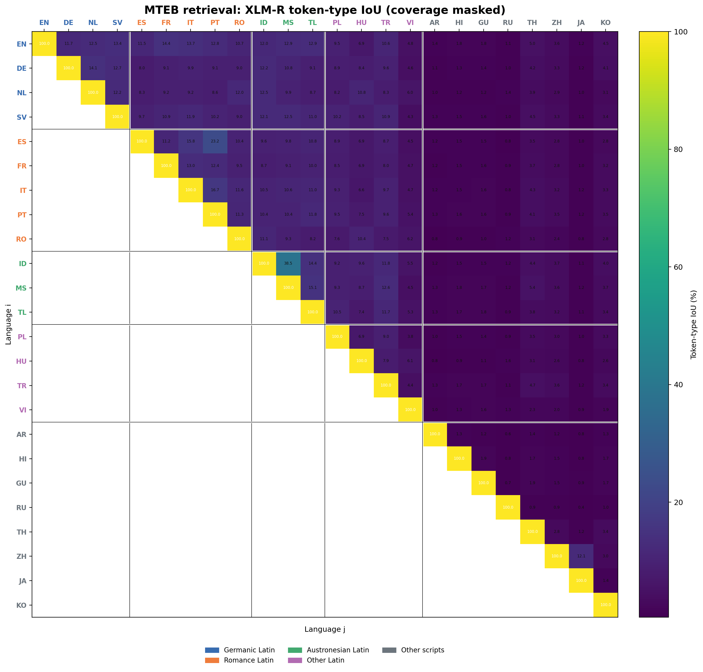
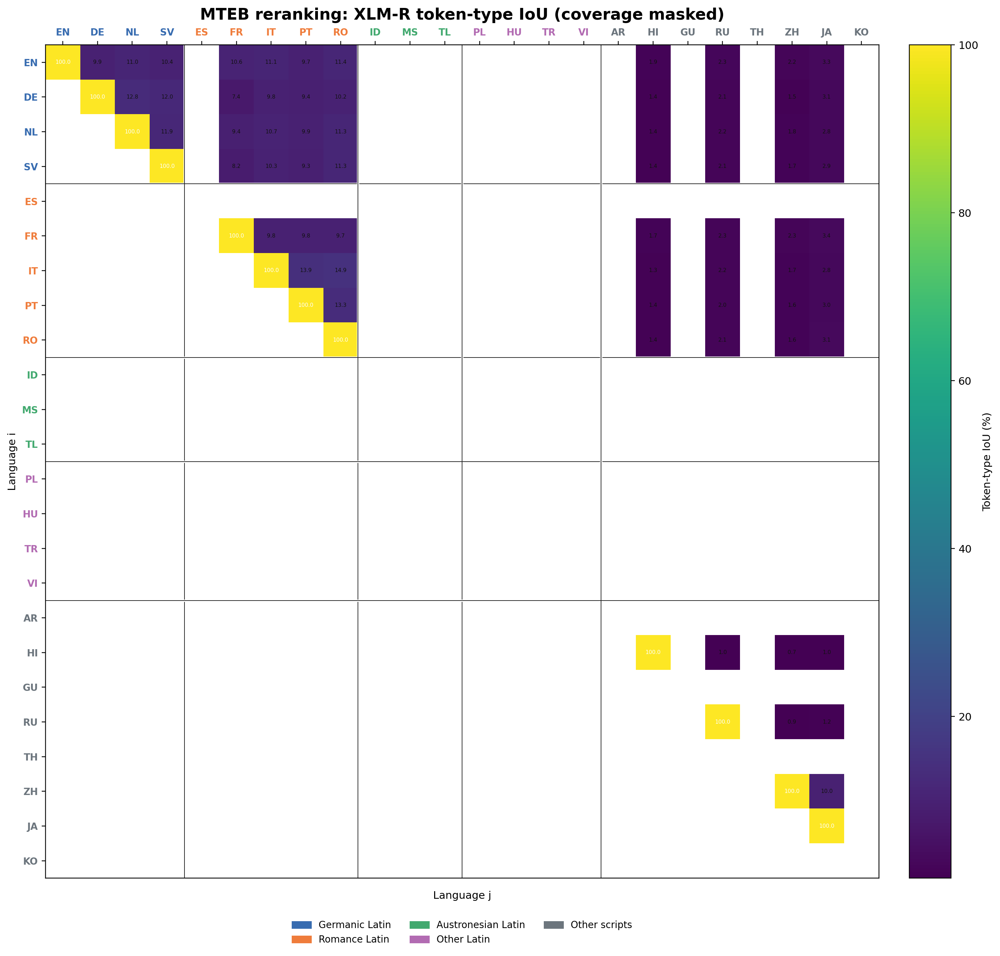

# XLM-R cross-lingual token overlap

Reproducible 24-language matrices for testing whether XLM-R tokenizer sharing
is a plausible correlate of multilingual Stage-2 performance degradation.

The repository completes **Pass 1 on FLORES-200**, implements and runs **Pass 2
on a coverage-balanced task slice of MTEB Multilingual v2**, and implements the
full-corpus runners for the local **Pass 3 STS/Belebele data** and **SQE**.
It does not claim that overlap causes a performance change.

## Checked-in FLORES result

All 28 result invariants pass. Across the 276 unordered off-diagonal pairs,
mean token-type IoU is **22.25% within Latin-script languages**, compared with
**5.34% for Latin/non-Latin pairs** and **4.43% within the non-Latin set**.
Indonesian–Malay is the strongest pair at **61.82%**. This makes overlap a
plausible signal worth testing against Stage-2 deltas, but does not establish
that it caused those deltas.



## What is measured

For language `i`, let `V_i` be the observed XLM-R token IDs and `c_i(t)` the
occurrence count after excluding tokenizer special/control IDs.

| Output | Definition | Shape |
|---|---|---|
| Shared types | `|V_i ∩ V_j|` | symmetric 24 × 24 |
| Token-type IoU | `100 × |V_i ∩ V_j| / |V_i ∪ V_j|` | symmetric; upper triangle supplied |
| Frequency overlap | `100 × Σ_{t∈V_i∩V_j} c_i(t) / Σ_{t∈V_i} c_i(t)` | directional 24 × 24 (`i → j`) |

Text is passed to the tokenizer exactly as released: there is no external
lowercasing, transliteration, accent stripping, or Unicode normalization.
Tokenizer-internal normalization remains active because it is part of genuine
XLM-R behavior. Encoding has no wrapper tokens, truncation, or padding.

## Reproduce the checked-in FLORES pass

```bash
python -m venv .venv
source .venv/bin/activate
pip install -r requirements-lock.txt
pip install -e . --no-deps
xlmr-token-overlap all-flores \
  --source-dir data \
  --output-dir results/flores
```

`all-flores` downloads and verifies:

- the official [FLORES-200 archive](https://dl.fbaipublicfiles.com/nllb/flores200_dataset.tar.gz),
  SHA-256 `b8b0b767...4011f6`;
- the official [`FacebookAI/xlm-roberta-base` tokenizer](https://huggingface.co/FacebookAI/xlm-roberta-base),
  revision `42f548f3...68bf6`, SHA-256 `a898ea75...9d2e2c`.

Only the 24 requested languages are extracted. FLORES text is licensed
CC BY-SA 4.0 and is intentionally not committed here; the derived matrices are
reproducible from the pinned public source.

To use the exact tokenizer from a trained model instead, point the runner at
that model's `tokenizer.json`:

```bash
xlmr-token-overlap run-flores \
  --flores-root data/flores200_dataset \
  --tokenizer-json /path/to/model/tokenizer.json \
  --output-dir results/my-model-tokenizer
```

## Outputs

The checked-in [`results/flores`](results/flores) directory contains:

- full CSV and Parquet matrices plus an upper-triangular IoU matrix;
- `pairwise_long.{csv,parquet}` with all 576 ordered pairs;
- per-language and per-split statistics;
- observed token frequencies for audit/re-analysis;
- grouped heatmaps using linguistic/script ordering;
- source/output checksums and runtime metadata in `manifest.json`;
- `validation_report.json` and a descriptive `REPORT.md`.

The matrix row order is Germanic Latin, Romance Latin, Austronesian Latin,
other Latin-script languages, then the eight non-Latin-script languages.
`language_key.csv` is the authoritative label mapping.

## Pass 2: MTEB Multilingual v2

The pinned MTEB pass produces `overall` plus five independent task-family
conditions. Classification, clustering, and retrieval cover all 24 requested
languages. The official task inventory provides usable STS data for 16 and
reranking data for 12; unsupported cells remain NA in full 24×24 views rather
than being imputed.

| Condition | Language coverage | Main source design |
|---|---:|---|
| Overall | 24/24 | Rebalanced selected family records |
| STS | 16/24 | Five official STS tasks |
| Retrieval | 24/24 | Belebele questions and passages |
| Classification | 24/24 | MASSIVE plus Gujarati News |
| Clustering | 24/24 | SIB-200 |
| Reranking | 12/24 | Six official reranking tasks |

The checked-in run passes all **55/55 aggregate checks**, in addition to the
28 native matrix invariants applied independently to every condition. Its
strongest observed token-type IoU pairs are:

| Condition | Strongest pair | Type IoU | Spearman vs. FLORES |
|---|---|---:|---:|
| Overall | Indonesian–Malay | 39.13% | 0.946 |
| STS | Spanish–Italian | 7.09% | 0.780 |
| Retrieval | Indonesian–Malay | 38.48% | 0.935 |
| Classification | Indonesian–Malay | 34.11% | 0.749 |
| Clustering | Indonesian–Malay | 46.64% | 0.982 |
| Reranking | Italian–Romanian | 14.93% | 0.780 |

The rank ordering is most stable against FLORES for clustering and overall.
All six task conditions have lower mean pairwise IoU than FLORES, by 5.36 to
7.75 percentage points; that is descriptive corpus evidence, not a causal
performance result. The balanced STS budget is 2,951 tokens per supported
language because the smallest official language slice sets the common cap.

### MTEB overall IoU heatmap


### MTEB task-wise IoU heatmaps

All task heatmaps use the same frozen 24-language axes as FLORES. Blank cells
in STS and reranking indicate languages without official task coverage.

| STS | Retrieval |
|---|---|
|  |  |
| **Classification** | **Clustering** |
|  |  |
| **Reranking** | |
|  | |

See [`results/mteb/REPORT.md`](results/mteb/REPORT.md) for the complete summary
and [`results/mteb`](results/mteb) for all CSV, Parquet, validation, provenance,
masked 24×24 matrices, and task-family heatmaps.

Reproduce the pass with:

```bash
pip install -r requirements-lock.txt
pip install -r requirements-mteb.txt
pip install -e . --no-deps
xlmr-token-overlap all-mteb \
  --source-dir data \
  --output-dir results/mteb \
  --flores-dir results/flores \
  --family-token-budget 20000 \
  --overall-token-budget 30000 \
  --seed 1729
```

The loader resolves the official benchmark at `mteb==2.19.5`, pins every
selected dataset revision, streams only selected configurations, applies
deterministic complete-record XLM-R token budgets, and commits no raw text.
See [`docs/MTEB_PROTOCOL.md`](docs/MTEB_PROTOCOL.md).

## Pass 3: translated STS and Belebele retrieval

The local Pass-3 runner uses all 24 languages and emits three independent
conditions:

| Condition | Included text |
|---|---|
| STS | every `sentence1` and `sentence2` |
| Retrieval | every query-row `text` and corpus-row `text`, once per row |
| Overall | the complete STS + retrieval union |

There is no character limit, tokenizer truncation, row sampling, or token-budget
sampling. Every complete text cell is passed to the same exact tokenizer.
Qrels validate the retrieval links but do not repeat query/document text.

```bash
xlmr-token-overlap all-pass3 \
  --datasets-root /group-volume/SSCore/User_Data/Sanskar/Benchmarking/SR_Gauss_24/model-orchestration/cache/datasets \
  --tokenizer-json data/tokenizers/xlm-roberta-base/tokenizer.json \
  --output-dir results/pass3 \
  --flores-dir results/flores
```

The command creates overall and task-wise matrices and heatmaps at
`results/pass3/{overall,sts,retrieval}`, plus comparisons against FLORES.
The audited STS files have all 24 languages but are not strictly row-aligned:
Hindi, Japanese, Korean, and Thai have different row counts and no stable ID
column exists. This is retained as a full-corpus distributional condition,
rather than silently dropping or fabricating rows.

## SQE

SQE is analyzed separately from Pass 3 because its domain coverage is uneven.

| Domain | Coverage | Conditions |
|---|---:|---|
| Settings | 24/24 | standard |
| Notes | 16/24 | standard, contextual, contextual-drop-time |
| Calendar | Korean only | all three variants |
| Call recording | Korean only | all three variants |
| Reminder | Korean only | all three variants |
| Voice recording | Korean only | all three variants |

Within each condition, every `data.text` and test-case `query` cell is encoded
in full. `gt_ids` validates query-to-data linkage and `remark` remains
metadata. There is intentionally no pooled SQE-overall condition because that
would confound language with domain coverage. `settings_standard` is the
complete 24-language SQE comparison; partial conditions receive masked 24×24
views.

```bash
xlmr-token-overlap all-sqe \
  --datasets-root /group-volume/SSCore/User_Data/Sanskar/Benchmarking/SR_Gauss_24/model-orchestration/cache/datasets \
  --tokenizer-json data/tokenizers/xlm-roberta-base/tokenizer.json \
  --output-dir results/sqe \
  --flores-dir results/flores
```

The default runs every domain and variant, including full token diagnostics for
Korean-only conditions. See
[`docs/PASS3_SQE_PROTOCOL.md`](docs/PASS3_SQE_PROTOCOL.md) for the frozen input
contract, full-text policy, coverage rules, and outputs. Results and README
heatmaps can be checked in after the private-data run; raw source text is never
committed.

## Generic Pass 2/3 interface

The generic runner accepts JSON Lines with one text-bearing input per row:

```json
{"condition":"mteb/sts","language_code":"eng_Latn","text":"...","example_id":"task:id:side-a","split":"test"}
{"condition":"mteb/retrieval","language_code":"eng_Latn","text":"...","example_id":"task:id:query","split":"test"}
```

```bash
xlmr-token-overlap run-jsonl \
  --input mteb_texts.jsonl \
  --tokenizer-json data/tokenizers/xlm-roberta-base/tokenizer.json \
  --output-dir results/mteb
```

Every `condition` is tokenized and written independently, so custom STS,
retrieval, classification, clustering, and reranking corpora cannot be
accidentally pooled. See [`docs/PLAN.md`](docs/PLAN.md).

## Validate or test

```bash
python -m unittest discover -s tests -v
xlmr-token-overlap validate results/flores
```

Validation checks matrix dimensions/order, symmetric metrics, 100% diagonals,
directional bounds, upper-triangle masking, pair uniqueness, and token-count
identities.

## Data and model citations

- NLLB Team et al. (2022), *No Language Left Behind: Scaling Human-Centered
  Machine Translation*.
- Conneau et al. (2020), *Unsupervised Cross-lingual Representation Learning
  at Scale*.

Code is MIT licensed. FLORES-200 retains its CC BY-SA 4.0 license.
